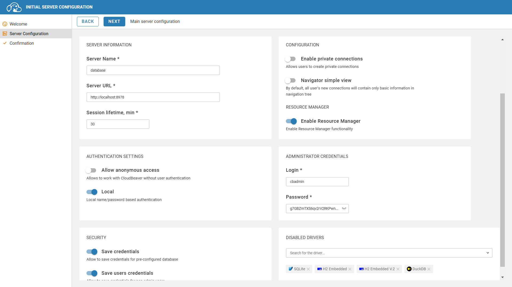
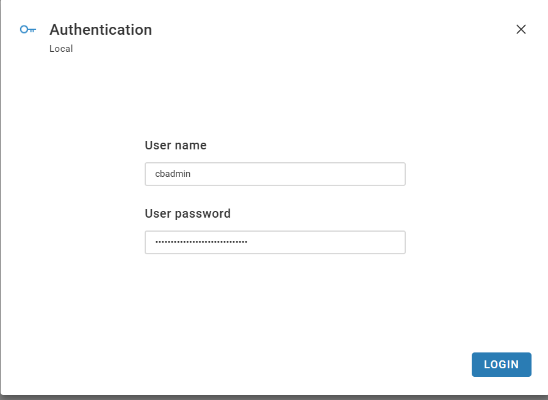
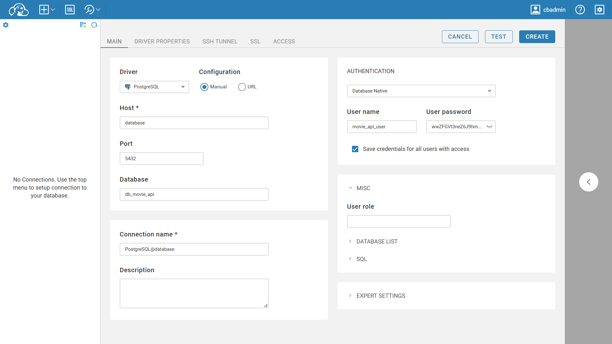

# 🗂️ Catalogo de Filmes API

Este é um projeto de uma API REST desenvolvida em Java com Spring Boot, destinada ao gerenciamento de um catálogo de filmes. A API permite realizar operações CRUD (Criar, Ler, Atualizar e Deletar) para filmes, atores, gêneros, idiomas, países, diretores e estúdios.

## ⚙️ Funcionalidades

### 📽️ **Filmes**
- Cadastre novos filmes.
- Atualize informações de filmes já existentes.
- Exclua registros de filmes desnecessários.
- Pesquise filmes por diferentes critérios(Com paginação).
- Busque filmes pelo ID.

### 🎭 **Atores**
- Cadastre atores no sistema.
- Atualize os dados dos atores registrados.
- Exclua atores que não são mais relevantes.
- Pesquise atores por diferentes critérios(Com paginação).
- Busque atores pelo ID.

### 🎥 **Gêneros**
- Cadastre novos gêneros cinematográficos.
- Atualize os gêneros existentes.
- Exclua gêneros que não são mais necessários.
- Pesquise gêneros disponíveis(Com paginação).
- Busque gêneros pelo ID.

### 🌐 **Idiomas**
- Cadastre idiomas disponíveis para filmes.
- Atualize informações sobre os idiomas registrados.
- Exclua idiomas que não são mais usados.
- Pesquise idiomas cadastrados(Com paginação).
- Busque idiomas pelo ID.

### 🗺️ **Países**
- Cadastre novos países ao sistema.
- Atualize as informações dos países cadastrados.
- Remova países que não são mais necessários.
- Pesquise países relacionados às produções(Com paginação).
- Busque países pelo ID.

### 🎬 **Diretores**
- Cadastre diretores de filmes.
- Atualize os dados dos diretores registrados.
- Exclua registros de diretores.
- Pesquise diretores cadastrados(Com paginação).
- Busque diretores pelo ID.

### 🏢 **Estúdios**
- Cadastre estúdios cinematográficos.
- Atualize as informações dos estúdios registrados.
- Exclua estúdios do sistema.
- Pesquise estúdios disponíveis(Com paginação).
- Busque estúdios pelo ID.

## Tecnologias Utilizadas

- ☕ **Java 17** 
- 💻 **IntelliJ IDEA** 
- 🌱 **Spring Boot** 
- 🔄 **Spring Data JPA** 
- 🐳 **Docker Compose** 
- 🔒 **Spring Security** 🔒
- 📦 **Lombok** 
- 🗄️ **PostgreSQL** 
- 🔧 **MapStruct** 🔧
- 📦 **Maven** 
- ✔️ **Jakarta Bean Validation** 
- 🎬 **OMDb API** 
- 📜 **Spring Doc**
- 🗃️ **DTOs**
- ⚠️ **Problem Details**
- 🔌 **FeignClient** 

## 📖 Estrutura de Pacotes

A estrutura de pacotes deste projeto foi organizada seguindo alguns princípios de **Domain-Driven Design (DDD)**, com o objetivo de promover uma aplicação modular, escalável e de fácil manutenção. Abaixo, uma explicação sucinta sobre cada pacote e sua função no sistema:

## 🧑‍💻 `application`

A camada de aplicação orquestra o fluxo entre os outros pacotes e contém os casos de uso da aplicação.

- **`constants`**: Constantes globais da aplicação, como mensagens e códigos de status.
- **`dto`**: Objetos de Transferência de Dados (DTOs) utilizados para comunicação entre camadas (ex: entre a API e a camada de aplicação).
- **`mapper`**: Classes para conversão entre diferentes tipos de objetos (ex: de `Entity` para `DTO`).
- **`utility`**: Funções utilitárias e helpers para tarefas gerais (ex: formatação de data, validações simples).

---

## 🏠 `domain` 

A camada de domínio é o coração do sistema, onde as regras de negócio e as entidades principais são modeladas.

- **`model`**: Entidades do domínio que representam os objetos de negócio principais.
- **`repository`**: Interfaces para abstração do acesso aos dados, como repositórios JPA ou outras fontes de persistência.
- **`service`**: Contém a lógica de negócios que orquestra as interações entre entidades e repositórios.
- **`specification`**: Especificações de consulta reutilizáveis, permitindo a criação de filtros dinâmicos e flexíveis.

---

## 🏗️ `infrastructure` 

Contém implementações e serviços de suporte que interagem com o mundo exterior ou com componentes transversais da aplicação.

- **`config`**: Configurações gerais do Spring e inicializações de dependências.
- **`constants`**: Constantes relacionadas à infraestrutura, como URLs de serviços externos e parâmetros de configuração.
- **`exception`**: Classes para tratamento de exceções personalizadas e manipulação de erros.
- **`external`**: Integrações com sistemas ou serviços externos (ex: integração com APIs externas como OMDB).
- **`interceptor`**: Interceptadores para manipulação de requisições e respostas, como logging e autenticação.
- **`security`**: Configuração de segurança, como autenticação, autorização e controle de acesso.

---

## 🌐 `interfaces` 

Define como a aplicação se comunica com o mundo exterior, expondo suas APIs ou interfaces de comunicação.

- **`api`**: Interfaces de serviços expostas, geralmente como REST ou outros protocolos.
- **`rest`**: Implementações concretas de controladores REST, manipulando as requisições HTTP.

---

##  🔄 `shared`

Contém componentes compartilhados e reutilizáveis em várias partes do sistema.

- **`config`**: Configurações globais que podem ser utilizadas em várias camadas do sistema.
- **`constants`**: Constantes compartilhadas, como parâmetros globais ou configurações.
- **`utils`**: Funções auxiliares reutilizáveis para operações comuns, como manipulação de strings ou coleções.

## Endpoints da API

### 🎬 Filmes

- `GET /api/v1/movies`: Pesquisar filmes.
- `POST /api/v1/movies`: Criar um novo filme.
- `GET /api/v1/movies/{id}`: Recuperar um filme pelo ID.
- `PUT /api/v1/movies/{id}`: Atualizar informações de um filme.
- `DELETE /api/v1/movies/{id}`: Deletar um filme.

### 🎭 Atores 

- `GET /api/v1/actors`: Pesquisar atores.
- `POST /api/v1/actors`: Criar um novo ator.
- `GET /api/v1/actors/{id}`: Recuperar um ator pelo ID.
- `PUT /api/v1/actors/{id}`: Atualizar informações de um ator.
- `DELETE /api/v1/actors/{id}`: Deletar um ator.

### 🎥 Gêneros 

- `GET /api/v1/genres`: Pesquisar gêneros.
- `POST /api/v1/genres`: Criar um novo gênero.
- `GET /api/v1/genres/{id}`: Recuperar um gênero pelo ID.
- `PUT /api/v1/genres/{id}`: Atualizar informações de um gênero.
- `DELETE /api/v1/genres/{id}`: Deletar um gênero.

### 🌐 Idiomas 

- `GET /api/v1/languages`: Pesquisar idiomas.
- `POST /api/v1/languages`: Criar um novo idioma.
- `GET /api/v1/languages/{id}`: Recuperar um idioma pelo ID.
- `PUT /api/v1/languages/{id}`: Atualizar informações de um idioma.
- `DELETE /api/v1/languages/{id}`: Deletar um idioma.

### 🗺️ Países 

- `GET /api/v1/countries`: Pesquisar países.
- `POST /api/v1/countries`: Criar um novo país.
- `GET /api/v1/countries/{id}`: Recuperar um país pelo ID.
- `PUT /api/v1/countries/{id}`: Atualizar informações de um país.
- `DELETE /api/v1/countries/{id}`: Deletar um país.

### 🎬 Diretores 

- `GET /api/v1/directors`: Pesquisar diretores.
- `POST /api/v1/directors`: Criar um novo diretor.
- `GET /api/v1/directors/{id}`: Recuperar um diretor pelo ID.
- `PUT /api/v1/directors/{id}`: Atualizar informações de um diretor.
- `DELETE /api/v1/directors/{id}`: Deletar um diretor.

### 🏢 Estúdios 

- `GET /api/v1/studios`: Pesquisar estúdios.
- `POST /api/v1/studios`: Criar um novo estúdio.
- `GET /api/v1/studios/{id}`: Recuperar um estúdio pelo ID.
- `PUT /api/v1/studios/{id}`: Atualizar informações de um estúdio.
- `DELETE /api/v1/studios/{id}`: Deletar um estúdio.

## 🚨 Tratamento de Exceptions na API 

A API utiliza o formato **Problem Details** para padronizar as respostas de erro, conforme a [RFC 7807](https://datatracker.ietf.org/doc/html/rfc7807). Esse formato facilita a identificação e tratamento dos problemas de forma estruturada e consistente.

## 📝 Atributos do Problem Details

- **type**: Identificador único para o tipo de problema, podendo ser uma URL ou um caminho relativo.  
- **title**: Descrição curta e legível do problema.  
- **status**: Código HTTP correspondente ao erro.  
- **detail**: Explicação detalhada e específica sobre o problema.  
- **instance**: Caminho ou recurso da API onde o erro ocorreu.  
- **violations** (Opcional): Lista de violações específicas, contendo informações detalhadas sobre campos ou regras quebradas.  

## 💥 Exceptions Tratadas 

### 1. `MethodArgumentNotValidException`
- **Descrição**: Lançada quando a validação de um argumento anotado com `@Valid` falha. Isso ocorre quando os dados fornecidos não atendem às restrições de validação definidas nas classes de modelo.
- **Status HTTP**: `400 BAD REQUEST`

---

### 2. `HttpMessageNotReadableException`
- **Descrição**: Disparada quando o corpo da requisição não pode ser lido, geralmente devido a JSON malformado ou formato incompatível.
- **Status HTTP**: `400 BAD REQUEST`

---

### 3. `PropertyBindingException`
- **Descrição**: Ocorre quando há tentativa de vincular propriedades desconhecidas ou inválidas durante a desserialização do JSON para objetos Java.
- **Status HTTP**: `400 BAD REQUEST`

---

### 4. `HandlerMethodValidationException`
- **Descrição**: Disparada ao validar os argumentos de um método anotado com `@Validated`. Indica que uma validação de método falhou.
- **Status HTTP**: `400 BAD REQUEST`

---

### 5. `NoHandlerFoundException`
- **Descrição**: Lançada quando não existe um handler (controlador) correspondente para a requisição. O caminho ou método solicitado não foi encontrado na API.
- **Status HTTP**: `404 NOT FOUND`

---

### 6. `HttpRequestMethodNotSupportedException`
- **Descrição**: Disparada quando o método HTTP usado (como `POST`, `GET`, `PUT`, etc.) não é suportado pelo endpoint da API.
- **Status HTTP**: `405 METHOD NOT ALLOWED`

---

### 7. `HttpMediaTypeNotSupportedException`
- **Descrição**: Ocorre quando o `Content-Type` enviado pelo cliente não é suportado pela API. Geralmente ocorre quando o corpo da requisição é enviado em um formato inesperado.
- **Status HTTP**: `415 UNSUPPORTED MEDIA TYPE`

---

### 8. `NotFoundException`
- **Descrição**: Exceção personalizada para indicar que o recurso solicitado não foi encontrado. Pode ser usada para recursos como um objeto ou entidade inexistente no banco de dados.
- **Status HTTP**: `404 NOT FOUND`

---

### 9. `ConflictException`
- **Descrição**: Exceção personalizada que é lançada quando há um conflito, como duplicidade de dados, ao tentar criar ou atualizar um recurso.
- **Status HTTP**: `409 CONFLICT`

---

### 10. `InternalServerErrorException`
- **Descrição**: Exceção personalizada para erros inesperados no servidor, como falhas internas que não podem ser previstas ou controladas.
- **Status HTTP**: `500 INTERNAL SERVER ERROR`

## 📂 Arquivos de Banco de Dados 
Ambos os arquivos são carregados automaticamente pelo Spring Boot na inicialização, garantindo que o banco de dados esteja configurado corretamente.

### `schema.sql`
- **Caminho**: `src/main/resources/sql/schema.sql`
- Define a estrutura do banco de dados, como tabelas, colunas, chaves primárias e estrangeiras.

### `data.sql`
- **Caminho**: `src/main/resources/sql/data.sql`
- Contém dados iniciais para popular as tabelas criadas no banco de dados.

## 🔧 Requisitos 

- ☕ **JDK 17 ou superior** 
- 📦 **Maven** 
- 🐳 **Docker Compose** 
- 🌱 **Spring Boot 3.3.4 ou superior** 
- 📥 **Postman** 

## ✨ Importando Coleções Postman 

As coleções Postman exportadas para este projeto estão localizadas na pasta `pos-architecture-java/tiago/postman`. Siga os passos abaixo para importar essas coleções no Postman:

### Passo 1: Localizando a Pasta de Coleções

As coleções exportadas do Postman estão armazenadas na pasta `pos-architecture-java/tiago/postman`. Dentro dessa pasta, você encontrará arquivos no formato `.json` que representam diferentes conjuntos de requisições para testar os endpoints da API.

### Passo 2: Importando no Postman 

1. 📥 Abra o **Postman** em sua máquina. 
2. 📂 Clique em **Import** no canto superior esquerdo da interface do Postman. 
3. ⬆️ Selecione a opção **Upload Files**. 
4. 📂 Navegue até a pasta `pos-architecture-java/tiago/postman` e selecione o arquivo `.json` da coleção que deseja importar. 
5. ✔️ Clique em **Open** e a coleção será carregada no seu Postman. 

## 🚀 Como Executar 

Siga os passos abaixo para iniciar o projeto:

```bash
# Clone este repositório
git clone https://github.com/tiagogarciaferreira/pos-architecture-java.git

# Navegue até a pasta do projeto
cd pos-architecture-java/tiago

# Certifique-se de ter o Docker e Docker Compose instalados e inicie os serviços auxiliares (como o banco de dados)
docker-compose up -d

# Execute a aplicação localmente usando Maven
./mvnw spring-boot:run

# Para encerrar os serviços auxiliares
docker-compose down

```

## 🔐 Autenticação da API 

A API utiliza **Autenticação Básica (Basic Authentication)** para garantir que apenas usuários autorizados possam acessar os recursos.

## 🧑‍💻 Usuários para Teste 

Aqui estão os usuários e credenciais de teste disponíveis para uso na API:

### Usuário Administrador
- **👤 Usuário:** `api_admin`  
- **🔑 Senha:** `NfH3Fzdy@avX#Y#Zj44S#LCA8zeaRcDqIhyjz5KhfTFb@hyB4X`  
- **🛡️ Função:** `ADMIN`  
- **📄 Descrição:** Usuário com permissões completas, incluindo gerenciamento administrativo(Leitura e escrita).
- **🟠 Esse é o usuário padrão já configurado no Postamn(Environment -> Local - Admin)**

---

### Usuário Comum
- **👤 Usuário:** `api_user`  
- **🔑 Senha:** `d#c4j8XbZ@I2hr9RwgsAtZgpwVxRSfqE8xUYaMLf2bfKQnXE#j`  
- **🛡️ Função:** `USER`  
- **📄 Descrição:** Usuário comum com permissões básicas de acesso à API(Leitura).
- **🟠 Esse é o usuário secundário configurado no Postamn(Environment -> Local - User)**

## 🗺️ Após iniciar, acesse a API no endereço:
[API - Endereço](https://localhost:8443/api)

## 🗺️ Acesse a documentação interativa da API (Swagger) no seguinte endereço:
[API - Documentação interativa](https://localhost:8443/api/swagger-ui.html)

## 🧑‍💻 Acessar o DBeaver
[DBeaver](http://localhost:8978/) | [Tutorial para Configuração](https://blog.programster.org/deploy-cloudbeaver-using-docker) (Começar do passo: `Web UI Setup`)

### Usuário
- **👤 DBeaver Usuário:** `cbadmin`  
- **🔑 DBeaver Senha:** `g7GBZmTXS6qv2rV2RKPwnNU6sBDx4J`  
- **🖥️ DBeaver Nome do Servidor:** `database`  
- **🗄️ Postgres Banco de dados:** `db_movie_api`
- **👤 Postgres Usuário:** `movie_api_user`  
- **🔑 Postgres Senha:** `wwZFGVt3neZ6J9hmR29ur8admVGv` 

## 📝 Passos

### 🔌 Conectando DBeaver: 

### 🔓 Login:

### 🔌 Conectando Postgres:
